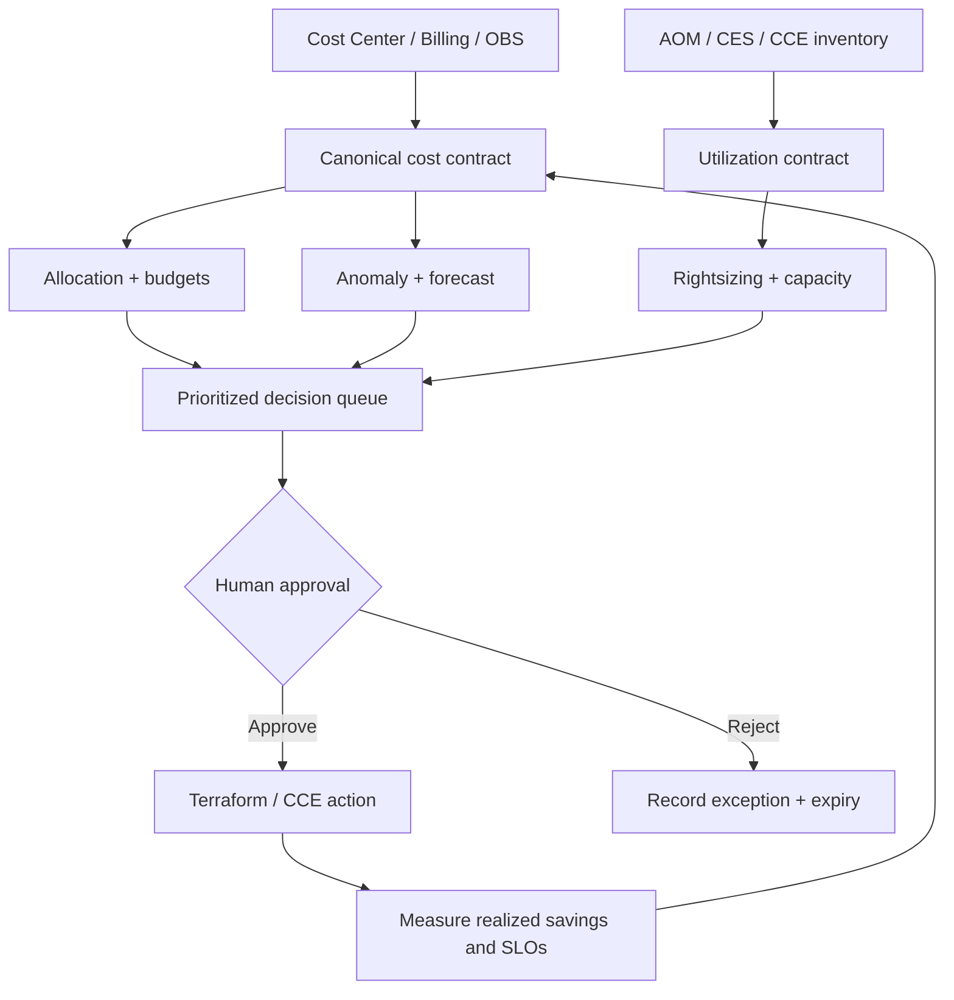

<div align="center">

# Huawei Cloud FinOps & Intelligent Capacity Optimization

**An explainable cloud cost control tower that turns Huawei Cloud billing, utilization, ownership, and capacity signals into prioritized engineering decisions.**

[](https://github.com/muratmiracg-dev/Huawei-Cloud-FinOps---Intelligent-Capacity-Optimization/actions/workflows/ci.yml)
[](https://github.com/muratmiracg-dev/Huawei-Cloud-FinOps---Intelligent-Capacity-Optimization/actions/workflows/codeql.yml)
[](https://github.com/muratmiracg-dev/Huawei-Cloud-FinOps---Intelligent-Capacity-Optimization/actions/workflows/security.yml)
[](https://www.python.org/)
[](https://www.huaweicloud.com/intl/en-us/)
[](LICENSE)

[Türkçe README](README_TR.md) · [Architecture](docs/architecture.md) · [Methodology](docs/optimization-methodology.md) · [Huawei Cloud Deployment](docs/deployment-huawei-cloud.md) · [Executive PDF](output/pdf/Huawei_Cloud_FinOps_Executive_Report_EN_TR.pdf) · [Executive Deck](presentation/Huawei_Cloud_FinOps_Executive_Deck_EN.pptx)

</div>

---

## Executive outcome

The project models a production-grade FinOps decision loop across cost
visibility, allocation, governance, forecasting, optimization, and capacity
safety. It does not stop at charts: every opportunity includes evidence,
estimated savings, confidence, risk, and a reversible action.

| Reproducible demo KPI | Result |
|---|---:|
| Current monthly amortized cost | **$6,133.36** |
| Conservative monthly savings opportunity | **$1,520.70** |
| Annualized savings opportunity | **$18,248.40** |
| Savings opportunity rate | **24.79%** |
| Cost allocation coverage | **97.43%** |
| Budget coverage | **100.00%** |
| Prioritized recommendations | **21** |
| Detected cost anomalies | **2** |
| FinOps maturity score | **96.4 / 100** |

> These results come from the committed deterministic synthetic dataset.
> Estimated savings are decision-support values, not a commercial commitment or
> a substitute for Huawei Cloud billing reconciliation.


## Why this project is different

- **Cost and capacity are evaluated together.** A cheap recommendation is rejected
  when P95 utilization or required headroom indicates service risk.
- **Savings are not double-counted.** The executive KPI conservatively keeps only
  the largest compatible saving per resource.
- **Decisions are explainable.** Every recommendation exposes observed P95 values,
  observation days, confidence, risk, current cost, action, and rationale.
- **Governance is executable.** OPA policies enforce cost-center, owner, environment,
  requests, limits, non-root execution, and HPA ceilings.
- **The full path is deployable.** FastAPI, Docker, Kustomize, Helm, Terraform,
  Prometheus, Grafana, CodeQL, and Trivy are included.
- **No cloud credentials are committed.** The demo runs offline while production
  adapters map Cost Center exports, Billing Center responses, OBS objects, and
  AOM/CES signals into a stable canonical contract.

## Architecture


The integration design follows current Huawei Cloud capabilities:

- Cost Center provides original/amortized cost analysis, forecasting, anomaly
  detection, cost tags, budgets, and Cost Details Export to OBS.
- Billing Center exposes bill summary and resource expenditure APIs for
  customer-built platforms.
- CCE Cloud Native Cost Governance combines CCE inventory, AOM metrics, OBS bill
  exports, and Cloud Eye signals.

Detailed service boundaries, trust zones, failure modes, and data flows are in
[docs/architecture.md](docs/architecture.md).

## Capability map

| Domain | Implemented capability | Output |
|---|---|---|
| Visibility | Original/amortized daily cost normalization | Service, project, product, owner, environment, and cost-center views |
| Allocation | Mandatory tag coverage and unallocated-cost detection | Coverage KPI, showback groupings, remediation |
| Governance | Budget evaluation and forecast breach status | Healthy, warning, forecast breach, breached |
| Anomaly detection | Rolling median and median absolute deviation | Severity, expected cost, deviation, robust score |
| Forecasting | Transparent monthly trend model with uncertainty | 1–18 month forecast and bounds |
| Compute optimization | ECS/RDS/CCE rightsizing with P95 headroom | Candidate flavor direction, risk, confidence, savings |
| Kubernetes efficiency | Request-to-observed-demand analysis | Request tuning before node-pool reduction |
| Idle resource control | Detached EVS, unbound EIP/ELB, idle non-prod compute | Reversible stop/release actions |
| Storage optimization | OBS lifecycle candidate detection | Tiering/expiration review with estimated savings |
| Commercial optimization | Stable pay-per-use baseline identification | Commitment or savings-plan review candidate |
| Capacity safety | Saturation and headroom breach detection | High-risk scale/autoscaling action |
| Operations | REST API, Prometheus metrics, Grafana dashboard, alerts | Control tower and runbooks |

## Decision flow



## Quick start

### 1. Run the deterministic analysis

```bash
python -m venv .venv
source .venv/bin/activate
python -m pip install -e ".[dev]"
python scripts/generate_demo_data.py
finops --data-dir data/demo analyze --output reports/demo-analysis.json
```

On Windows PowerShell, activate with `.venv\Scripts\Activate.ps1`.

### 2. Start the API

```bash
FINOPS_DATA_DIR=data/demo uvicorn finops.api:app --app-dir src --host 0.0.0.0 --port 8080
```

Open:

- Swagger: `http://localhost:8080/docs`
- Executive summary: `http://localhost:8080/api/v1/summary`
- Prometheus: `http://localhost:8080/metrics`

### 3. Start the local control tower

```bash
docker compose up --build
```

| Component | Address |
|---|---|
| FinOps API | `http://localhost:8080/docs` |
| Prometheus | `http://localhost:9090` |
| Grafana | `http://localhost:3000` |

Change the example Grafana password in `compose.yaml` before any shared
environment is used.

## API surface

| Method | Endpoint | Purpose |
|---|---|---|
| `GET` | `/health/live` | Process liveness |
| `GET` | `/health/ready` | Data-contract readiness |
| `GET` | `/api/v1/summary` | Executive KPIs |
| `GET` | `/api/v1/recommendations` | Prioritized decisions with optional savings filter |
| `GET` | `/api/v1/anomalies` | Robust cost anomalies |
| `GET` | `/api/v1/forecast?months=3` | Monthly forecast and uncertainty |
| `GET` | `/api/v1/allocation?dimension=product` | Cost allocation |
| `GET` | `/api/v1/budgets` | Actual and forecast budget status |
| `POST` | `/api/v1/analysis/run` | Full decision-loop execution |
| `GET` | `/metrics` | Prometheus exposition |

See [docs/api.md](docs/api.md) for response examples and error behavior.

## Huawei Cloud deployment

### Kubernetes / CCE

```bash
kubectl apply -k deploy/kubernetes/overlays/production
```

Or use Helm:

```bash
helm upgrade --install finops deploy/helm/finops-optimizer \
  --namespace finops-system \
  --create-namespace
```

### Terraform

```bash
cd infra/terraform
cp terraform.tfvars.example terraform.tfvars
terraform init -backend-config=backend.hcl
terraform plan -out=finops.tfplan
terraform apply finops.tfplan
```

The Terraform layer provisions the CCE network and autoscaled node pool, an OBS
bucket for cost-detail exports, and an SMN alert topic. Authentication is read
from the standard Huawei Cloud provider environment variables; credentials are
never stored in this repository.

Read [docs/deployment-huawei-cloud.md](docs/deployment-huawei-cloud.md) before
applying infrastructure.

## Quality and security

The repository includes:

- **53 automated tests** across analytics, adapters, API, CLI, and telemetry
- **97.09% measured coverage** with a **90% required gate**
- Ruff linting and deterministic-data drift detection
- Terraform format and validation checks
- Container build and readiness smoke test
- CodeQL analysis
- Trivy high/critical filesystem scanning
- Non-root, read-only containers with dropped Linux capabilities
- Pod Security restricted namespace, NetworkPolicy, HPA, and PDB
- OPA policies for cost labels, requests/limits, security context, and capacity
  ceilings
- Threat model, incident runbooks, decision records, and rollback guidance

Run the local checks:

```bash
make test
make lint
make analyze
make validate
python scripts/finops_gate.py reports/demo-analysis.json \
  --max-monthly-cost 6500 \
  --min-allocation-coverage 95 \
  --max-high-risk 2
```

## Repository map

```text
src/finops/                 Analytics engine, adapters, API, and CLI
tests/                      Unit, integration, contract, and telemetry tests
data/demo/                  Deterministic synthetic cost and utilization data
reports/                    Reproducible machine-readable analysis output
deploy/kubernetes/          Secure base and development/production overlays
deploy/helm/                Configurable production Helm chart
infra/terraform/            Huawei Cloud CCE, OBS, and SMN infrastructure
policies/finops/            OPA, allocation, budget, and change guardrails
observability/              Prometheus alerts and Grafana control tower
docs/                       Architecture, methods, operations, ADRs, and portfolio copy
presentation/               Executive PowerPoint
output/pdf/                 Render-verified executive report
.github/workflows/          CI, CodeQL, and Trivy automation
```

## Documentation

| Document | Audience |
|---|---|
| [Architecture](docs/architecture.md) | Cloud/platform engineers |
| [FinOps operating model](docs/finops-operating-model.md) | Engineering, finance, product |
| [Optimization methodology](docs/optimization-methodology.md) | Reviewers and decision owners |
| [Data contracts](docs/data-contracts.md) | Data and integration engineers |
| [Huawei Cloud deployment](docs/deployment-huawei-cloud.md) | Cloud/DevOps teams |
| [Security and threat model](docs/security-threat-model.md) | Security and platform teams |
| [Validation evidence](docs/validation.md) | Reviewers and auditors |
| [Executive summary](docs/reports/executive-summary.md) | Leadership |
| [TR/EN portfolio descriptions](docs/portfolio/) | LinkedIn, CV, GitHub |

## Design constraints

- Recommendations require owner approval; the demo never mutates cloud resources.
- Actual savings depend on regional price, billing mode, commitment eligibility,
  taxes, discounts, and workload behavior.
- Current-month resource expenditure data may be delayed and is not treated as
  final reconciliation data.
- Production integrations should use least-privilege IAM agencies and secret
  management, not long-lived keys in files.

## Official references

- [Huawei Cloud Cost Center functions](https://support.huaweicloud.com/intl/en-us/usermanual-cost/costcenter_0000001.html)
- [Cost Analysis and Container Cost Insights](https://support.huaweicloud.com/intl/en-us/usermanual-cost/costcenter_000002_09.html)
- [Cost Tags](https://support.huaweicloud.com/intl/en-us/usermanual-cost/costcenter_000005_01.html)
- [Budgets](https://support.huaweicloud.com/intl/en-us/usermanual-cost/costcenter_0000023_1.html)
- [Billing Center bill summary API](https://support.huaweicloud.com/intl/en-us/api-oce/mbc_00008.html)
- [Resource expenditure API](https://support.huaweicloud.com/intl/en-us/api-oce/mbc_00004.html)
- [CCE Cloud Native Cost Governance](https://support.huaweicloud.com/intl/en-us/usermanual-cce/cce_10_0877.html)
- [CCE node pool overview](https://support.huaweicloud.com/intl/en-us/usermanual-cce/cce_10_0081.html)

## Author

**Murat Miraç Gedik**
Statistics · Data Analytics · Cloud DevOps · FinOps · Huawei Cloud

This portfolio project extends hands-on experience from the HUAWEI Student
Developers Türkiye Cloud DevOps program into cost governance, cloud economics,
observability, and capacity engineering.
