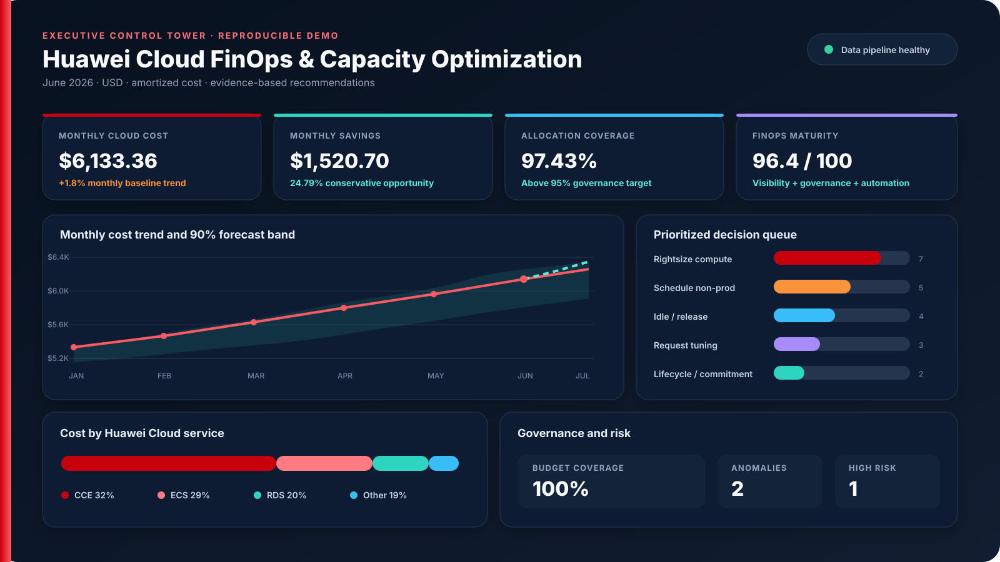

<div align="center">

# Huawei Cloud FinOps ve Akıllı Kapasite Optimizasyonu

**Huawei Cloud maliyet, kullanım, sahiplik ve kapasite sinyallerini öncelikli ve açıklanabilir mühendislik kararlarına dönüştüren profesyonel FinOps platformu.**

[English README](README.md) · [Mimari](docs/architecture.md) · [Metodoloji](docs/optimization-methodology.md) · [Huawei Cloud Kurulumu](docs/deployment-huawei-cloud.md) · [20 Sayfalık Yönetici PDF’i](output/pdf/Huawei_Cloud_FinOps_Executive_Report_EN_TR.pdf) · [18 Slaytlık Sunum](presentation/Huawei_Cloud_FinOps_Executive_Deck_EN.pptx)

</div>

## Projenin amacı

Bu proje, yalnızca bulut faturalarını görselleştiren bir dashboard değildir.
Huawei Cloud maliyet ve kullanım verilerini analiz ederek:

- maliyetlerin ürün, ekip, ortam, kurumsal proje ve maliyet merkezi bazında
  dağıtılmasını,
- bütçe ve tahmini bütçe aşımlarının izlenmesini,
- beklenmeyen maliyet artışlarının tespit edilmesini,
- ECS, RDS ve CCE kaynakları için kapasite riski kontrollü rightsizing
  önerilerinin oluşturulmasını,
- kullanılmayan EVS, EIP ve ELB kaynaklarının belirlenmesini,
- OBS yaşam döngüsü ve satın alma modeli fırsatlarının değerlendirilmesini,
- önerilerin risk, güven, kanıt ve tahmini tasarrufa göre önceliklendirilmesini

sağlar.

## Tekrarlanabilir demo sonuçları

| KPI | Sonuç |
|---|---:|
| Güncel aylık amortize maliyet | **6.133,36 USD** |
| Aylık tasarruf fırsatı | **1.520,70 USD** |
| Yıllıklandırılmış tasarruf fırsatı | **18.248,40 USD** |
| Tasarruf fırsatı oranı | **%24,79** |
| Maliyet dağıtım kapsamı | **%97,43** |
| Bütçe kapsamı | **%100,00** |
| Önceliklendirilmiş öneri | **21** |
| Tespit edilen maliyet anomalisi | **2** |
| FinOps olgunluk puanı | **96,4 / 100** |

Sonuçlar depodaki deterministik ve tamamen sentetik veri setinden üretilir.
Tahmini tasarruflar karar desteği amaçlıdır; ticari taahhüt veya fatura
mutabakatı değildir.



## Profesyonel proje kapsamı

- Python tabanlı açıklanabilir optimizasyon motoru
- FastAPI REST API ve Swagger
- Maliyet tahmini ve güven aralıkları
- Robust median/MAD maliyet anomalisi tespiti
- P95 CPU, bellek ve ağ kullanımına dayalı rightsizing
- Kubernetes request verimliliği ve CCE kapasite riski
- Maliyet etiketi ve bütçe politika kapıları
- Docker Compose ile yerel kontrol kulesi
- Prometheus, Grafana ve hazır alarm kuralları
- Güvenli Kubernetes tabanı, Kustomize dev/prod overlay’leri
- Parametrik Helm chart
- Huawei Cloud CCE, OBS ve SMN için Terraform
- CodeQL, Trivy, Ruff, test, coverage ve drift kontrollü GitHub Actions
- Mimari, tehdit modeli, runbook, ADR, yönetici özeti ve TR/EN portföy metinleri
- 53 otomatik test, %97,09 coverage ve 20 sayfalık görsel olarak doğrulanmış
  yönetici raporu

## Hızlı başlangıç

```bash
python -m venv .venv
source .venv/bin/activate
python -m pip install -e ".[dev]"
python scripts/generate_demo_data.py
finops --data-dir data/demo analyze --output reports/demo-analysis.json
```

Windows PowerShell için aktivasyon komutu:

```powershell
.venv\Scripts\Activate.ps1
```

API:

```bash
FINOPS_DATA_DIR=data/demo uvicorn finops.api:app --app-dir src --host 0.0.0.0 --port 8080
```

Docker kontrol kulesi:

```bash
docker compose up --build
```

## Karar güvenliği

Platform kaynakları otomatik olarak silmez veya küçültmez. Üretilen öneriler:

1. kanıt ve güven puanıyla oluşturulur,
2. kapasite ve SLO riskiyle sınıflandırılır,
3. aynı kaynak için birbiriyle çakışan tasarrufları çift saymaz,
4. kaynak sahibinin onayına gönderilir,
5. geri döndürülebilir uygulama ve ölçüm adımıyla tamamlanır.

## Huawei Cloud uyumu

Mimari; Cost Center maliyet analizi, amortize maliyet, maliyet etiketleri,
bütçeler, OBS Cost Details Export, Billing Center API’leri, CCE kaynak
envanteri, AOM metrikleri ve Cloud Eye sinyalleriyle uyumlu olacak şekilde
tasarlanmıştır.

Kurulum öncesinde [Huawei Cloud dağıtım rehberini](docs/deployment-huawei-cloud.md)
ve [güvenlik/tehdit modelini](docs/security-threat-model.md) okuyun.

## Proje sahibi

**Murat Miraç Gedik**
İstatistik · Veri Analitiği · Cloud DevOps · FinOps · Huawei Cloud

Proje, HUAWEI Student Developers Türkiye Cloud DevOps programındaki SWR, CCE,
Kubernetes, AOM, OBS, Secret/ConfigMap ve altyapı deneyimini FinOps, bulut
ekonomisi ve kapasite mühendisliğiyle birleştirir.
