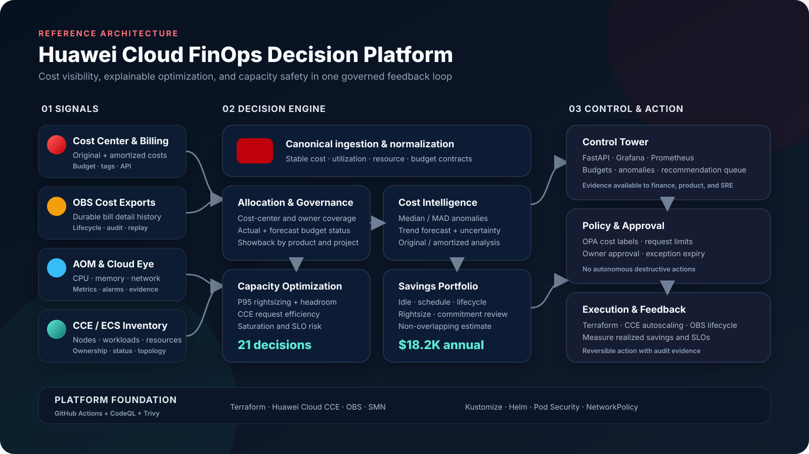
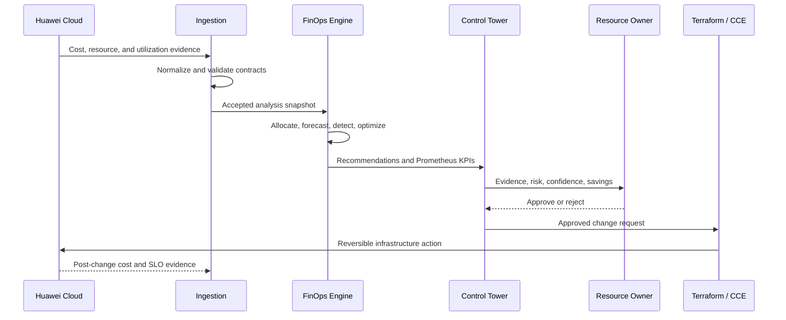
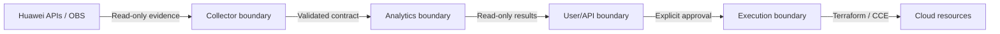

# Architecture

## System intent

The platform is a read-only decision system between Huawei Cloud financial
telemetry and approved infrastructure execution. It converts inconsistent cost,
inventory, ownership, and utilization signals into a canonical evidence model,
then produces reviewable recommendations.

The architecture separates four concerns:

1. **Collection** - obtain cost and capacity evidence without embedding cloud
   credentials in analytics.
2. **Decision** - calculate allocation, anomalies, forecasts, savings, and
   capacity risk through pure, testable functions.
3. **Control** - expose decisions through an API, metrics, dashboards, policies,
   and runbooks.
4. **Execution** - apply an approved change through a separate Terraform/CCE
   workflow and measure the result.

## Logical components

| Component | Responsibility | Failure isolation |
|---|---|---|
| Cost collector | Cost Center exports or Billing Center response mapping | Failed collection does not modify the last accepted dataset |
| Metric collector | AOM/CES/CCE utilization and inventory mapping | Missing metrics reduce confidence and block aggressive rightsizing |
| CSV/OBS adapter | Canonical offline and production batch contract | Malformed rows fail readiness instead of producing partial decisions |
| Allocation service | Showback dimensions and coverage | Unknown dimensions return a controlled validation error |
| Anomaly service | Rolling median/MAD spike detection | Insufficient history produces no anomaly rather than a false positive |
| Forecast service | Monthly trend and uncertainty bands | Empty history returns an empty forecast |
| Optimization service | Rightsizing, idle, schedule, lifecycle, commitment, risk | Rules are independent, explainable, and covered by tests |
| FinOps engine | Orchestrates one consistent analysis snapshot | Savings are de-duplicated per resource |
| FastAPI | Read-only delivery and health contracts | Readiness fails when canonical files are unavailable |
| Prometheus/Grafana | Operational and executive observability | Dashboard loss does not affect analytics |
| Policy gate | Cost labels, resources, security, and capacity ceilings | A denied change remains unapplied |

## Data flow

## Huawei Cloud alignment

| Huawei Cloud capability | Platform use |
|---|---|
| Cost Center Cost Analysis | Original and amortized cost views |
| Cost Details Export | Long-lived cost/usage detail in OBS |
| Cost Tags | Product, owner, environment, and cost-center allocation |
| Budgets | Actual and forecast threshold management |
| Billing Center APIs | Bill summary and resource expenditure integration |
| CCE | Workload inventory, node pools, deployment target |
| AOM | Container/ECS utilization and operational evidence |
| Cloud Eye (CES) | Cloud resource metrics and alert signals |
| OBS | Cost export, audit evidence, and report retention |
| SMN | Budget, anomaly, and capacity-risk notification target |
| SWR | Production container image registry |

## Trust boundaries

- The collector is the only component that needs access to cloud evidence.
- Analytics do not require AK/SK values and can run on deterministic local data.
- The public API has no mutation endpoint.
- Execution credentials and plans belong to a separately approved deployment
  workflow.
- The instance metadata address is blocked by Kubernetes NetworkPolicy.

## Deployment topology

The production overlay uses three application replicas, an HPA range of 3–10,
a PDB with at least one available pod, zone-aware topology spreading, non-root
security context, a read-only root filesystem, and a default-deny style network
policy.

CCE node-pool capacity is managed independently from application HPA capacity:

- HPA scales application pods within approved bounds.
- CCE node-pool autoscaling supplies or removes pay-per-use nodes.
- The optimization engine flags request inefficiency before recommending a
  smaller node pool.
- P95 utilization plus policy headroom protects workload SLOs.

## Reliability model

| Failure | Expected behavior | Recovery |
|---|---|---|
| Cost export delayed | Retain previous accepted snapshot; mark freshness | Re-run after export availability |
| Metric gap | Lower recommendation confidence; avoid stop/resize automation | Restore AOM/CES collection and rerun |
| Anomalous current-month bill | Flag as estimated and non-reconciliation data | Compare final bill after settlement |
| API pod loss | Service routes to healthy replicas | Deployment/HPA replaces pod |
| Grafana loss | Analytics and API continue | Recreate from provisioned JSON |
| Bad policy change | CI/OPA rejects manifest | Revert policy commit |
| Wrong recommendation | No automatic mutation occurs | Reject or expire recommendation |

## Non-functional requirements

- Reproducible output from a fixed synthetic dataset.
- Deterministic rule behavior under test.
- No double counting in executive savings.
- No secrets or customer data in source control.
- At least 90% analytics test coverage in CI.
- High/critical vulnerability scanning.
- Reversible infrastructure changes with owner approval.
- Human-readable evidence for every decision.

## Related decisions

- [ADR-001: Canonical local contract](adr/0001-canonical-cost-contract.md)
- [ADR-002: Read-only decision engine](adr/0002-read-only-decision-engine.md)
- [ADR-003: Conservative savings portfolio](adr/0003-conservative-savings.md)
