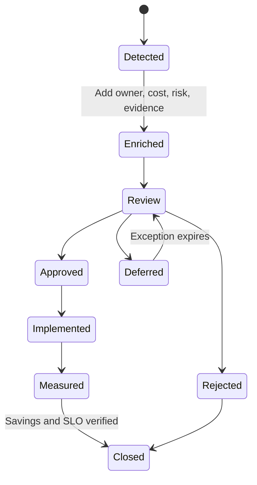

# FinOps operating model

## Objective

Create a shared operating rhythm where finance, product, engineering, and SRE
use the same cost and capacity evidence. The platform supplies decisions; teams
remain accountable for business context and execution.

## Decision lifecycle

## RACI

| Activity | Finance | Product | Resource owner | SRE/platform | Security |
|---|---|---|---|---|---|
| Budget baseline | A/R | C | I | C | I |
| Cost allocation rules | A | C | R | C | I |
| Recommendation triage | C | C | R | A/R | I |
| Commitment purchase | A/R | C | C | C | I |
| Rightsize/schedule | I | C | A/R | R | I |
| Capacity-risk response | I | I | R | A/R | I |
| IAM/network policy | I | I | C | R | A/R |
| Realized savings | A/R | C | R | C | I |

`A` = accountable, `R` = responsible, `C` = consulted, `I` = informed.

## Cadence

| Cadence | Review |
|---|---|
| Daily | Pipeline freshness, anomalies, capacity risks |
| Weekly | Top savings queue, expiring exceptions, unallocated costs |
| Monthly | Budget variance, forecast, realized savings, commitment coverage |
| Quarterly | Threshold calibration, architecture efficiency, maturity score |

## KPI definitions

| KPI | Definition | Target |
|---|---|---:|
| Allocation coverage | Cost with owner, cost center, product, and environment | >= 95% |
| Budget coverage | Resource cost covered by at least one approved budget | >= 95% |
| Savings conversion | Realized / approved savings | >= 70% |
| Recommendation aging | Median days from detection to decision | <= 14 days |
| Exception expiry | Exceptions with an active owner and expiry | 100% |
| Capacity safety | Executed changes without SLO regression | 100% |
| Forecast accuracy | Absolute variance after a closed billing month | Calibrated quarterly |

## Recommendation review checklist

- Is the owner known?
- Is the workload still required?
- Is evidence recent and complete?
- Is the savings estimate non-overlapping?
- Does the action preserve required headroom?
- Are seasonality and planned events represented?
- Is there a rollback or recovery path?
- Is the billing mode or commitment eligible?
- Who measures realized savings?

## Exception policy

An exception must include owner, reason, expiry, risk, and next review date.
Permanent exceptions are not accepted; an expiring renewal maintains
accountability and prevents stale exclusions.

## Definition of done

An optimization is closed only when:

1. the approved change is implemented,
2. SLO and error-rate evidence remains acceptable,
3. a complete billing period is measured,
4. realized savings are recorded,
5. related budgets and forecasts are updated.
